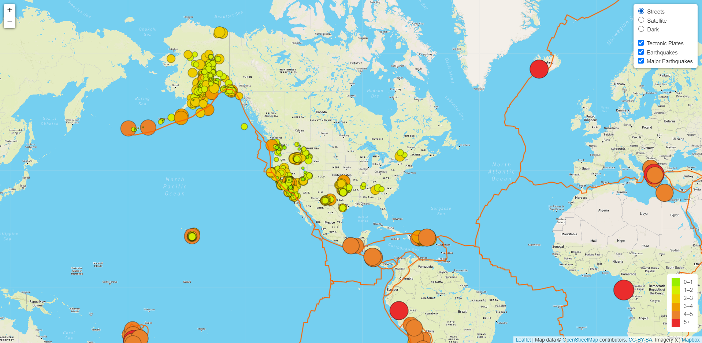
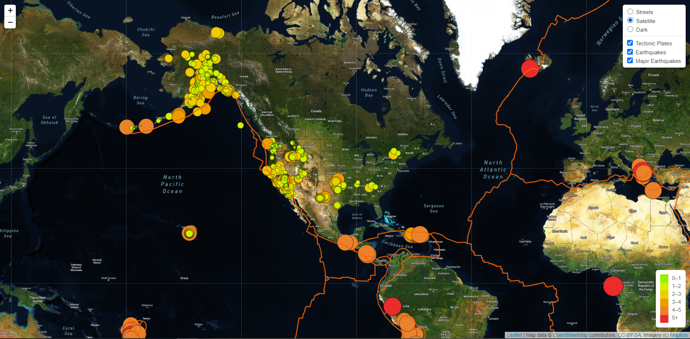
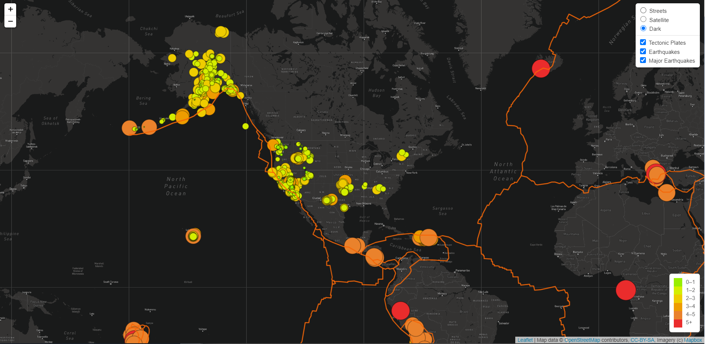

# Mapping_Earthquakes

## Overview of the project

Gather data from the U.S. Geological Survey (USGS) website and create an eartquake map using the Mapbox API with three different map styles (Streets, Satellite and Dark) and three overlays to represent the earthquake data in relation to the tectonic plates’ location on the earth, and earthquakes with a magnitude greater than 4.5 for the past 7 days.

## Resources

U.S. Geological Survey (USGS) website: 
<a href="https://earthquake.usgs.gov/" target="_blank">https://earthquake.usgs.gov/</a>

Earthquake GeoJSON data for the past 7 Days:
<a href="https://earthquake.usgs.gov/earthquakes/feed/v1.0/summary/all_week.geojson" target="_blank">https://earthquake.usgs.gov/earthquakes/feed/v1.0/summary/all_week.geojson</a>

Major earthquake GeoJSON data (magnitude 4.5+) for the past 7 Days:
<a href="https://earthquake.usgs.gov/earthquakes/feed/v1.0/summary/4.5_week.geojson" target="_blank">https://earthquake.usgs.gov/earthquakes/feed/v1.0/summary/4.5_week.geojson</a>

Tectonic plate data: 
<a href="https://raw.githubusercontent.com/fraxen/tectonicplates/master/GeoJSON/PB2002_boundaries.json" target="_blank">https://raw.githubusercontent.com/fraxen/tectonicplates/master/GeoJSON/PB2002_boundaries.json</a>

Mapbox API:
<a href="https://www.mapbox.com" target="_blank">https://www.mapbox.com</a>

Mapbox Styles:
<a href="https://docs.mapbox.com/api/maps/styles" target="_blank">https://docs.mapbox.com/api/maps/styles</a>

## Results

### Streets style:

### Satellite style:

### Dark style:

